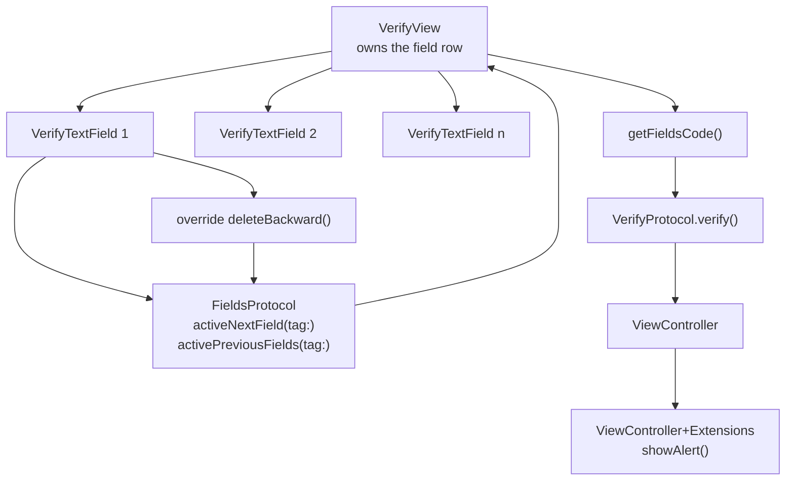
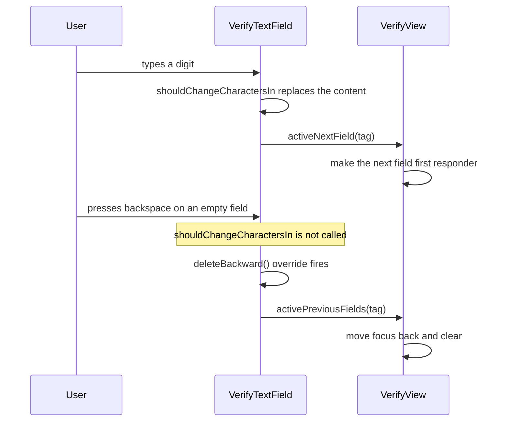

# Code Verification Field

*A one time code input where focus moves correctly on typing, pasting and deleting.*

    

## Overview

Six separate boxes that behave as a single field. This looks trivial until backspace is pressed on an
empty box, at which point the naive implementation does nothing because `UITextField` never reports a
deletion from an empty field.

## Focus movement



## Why deleteBackward matters



Overriding `deleteBackward` is the only reliable hook for a backspace on an empty field, and it is the
difference between a code input that feels native and one that traps the user.

## Implementation notes

- **Two protocols, two directions.** `FieldsProtocol` carries field events upward to the view,
  `VerifyProtocol` carries the completed code up to the controller. Neither side holds a concrete type.
- **Tags for ordering.** Each field carries its index as a tag, so the view can compute the neighbour
  without keeping a separate array lookup.
- **Single character enforcement.** `shouldChangeCharactersIn` replaces rather than appends, so a fast
  typist cannot leave two digits in one box.
- **The code assembled on demand.** `getFieldsCode()` joins the field values only when verification is
  requested, so there is no duplicated state to keep in sync.

## Project structure

```
BasicCodeVerify/
├── Views/        VerifyTextField, VerifyView
├── Controllers/  ViewController, SecondViewController
└── Extensions/   ViewController+Extensions
```

## Requirements

Xcode 15 or later, iOS 17.5 or later. No external dependencies.
